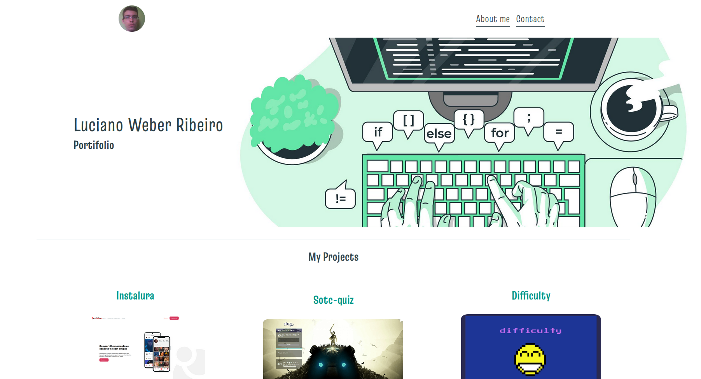

# My Portfolio

My portfolio created during the JamStack 'Alura Bootcamp to test my skills learned in the classes 

:computer: Tecnologies used

- Reactjs
- Nextjs
- Styled Components
- Prop-types
- Eslint

Icons on Linkedin,Github and Cv in a footer made by <a href="https://www.freepik.com" title="Freepik">Freepik</a> from <a href="https://www.flaticon.com/" title="Flaticon">www.flaticon.com</a>

  <h3>Desktop Mode and Mobile Mode</h3>

  
  

